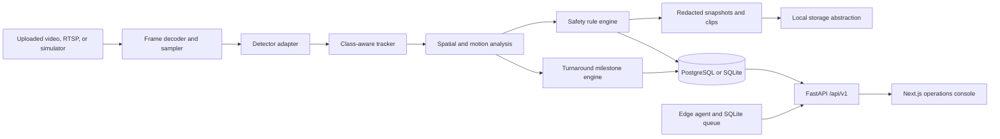
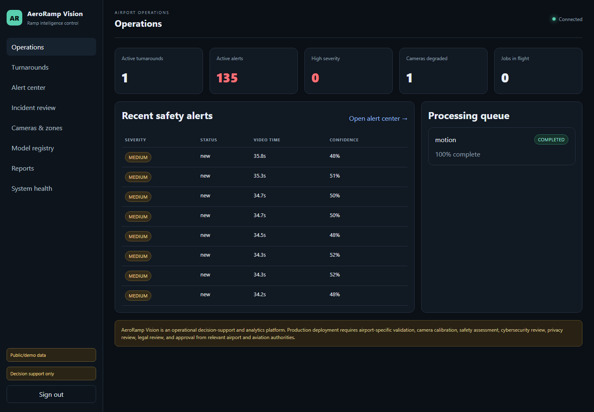
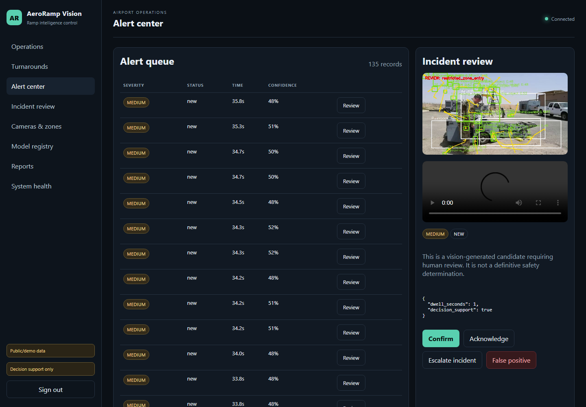
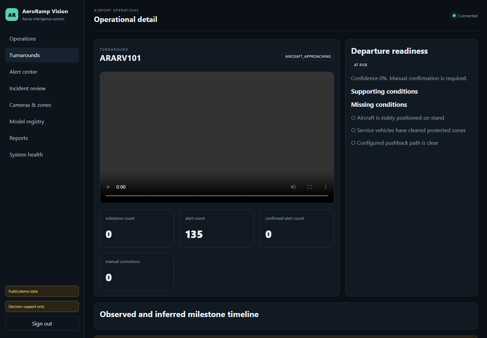
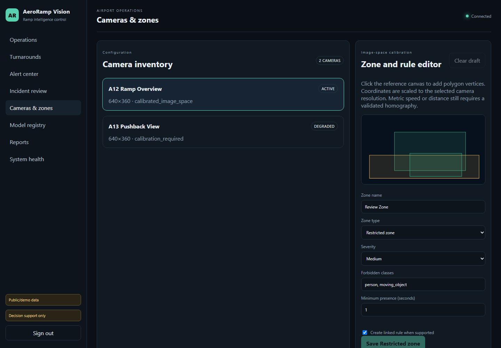
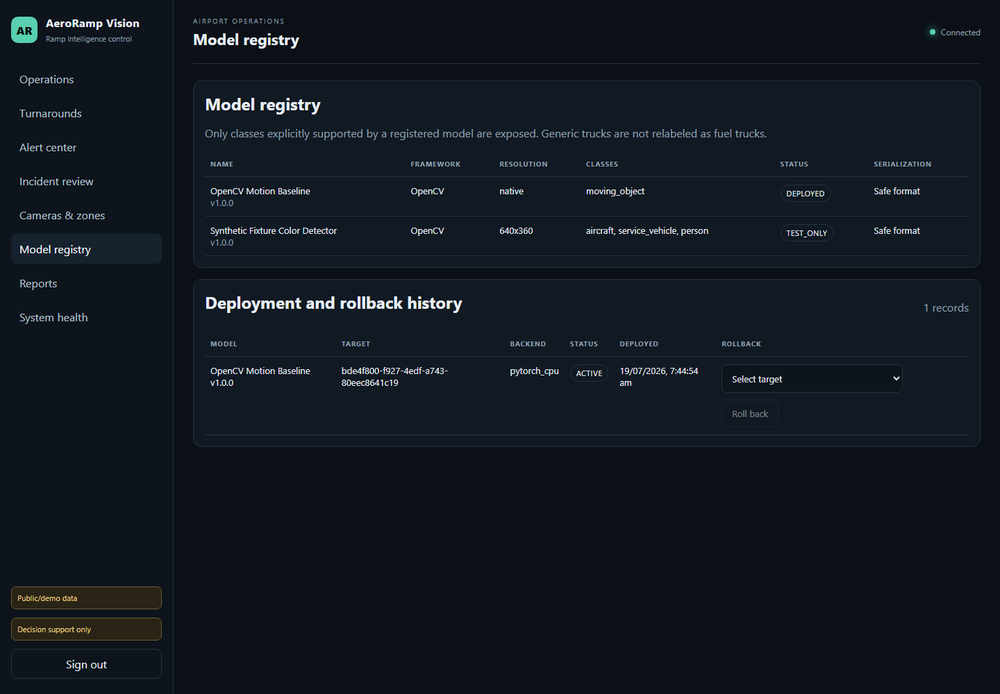
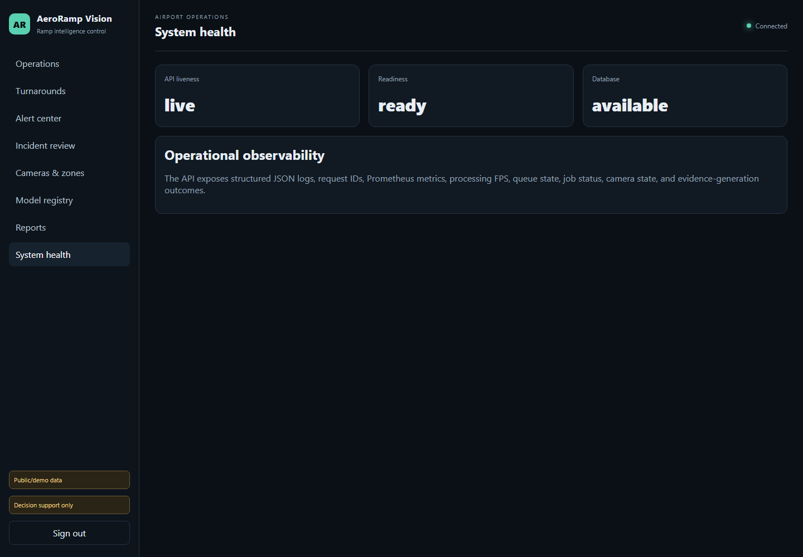
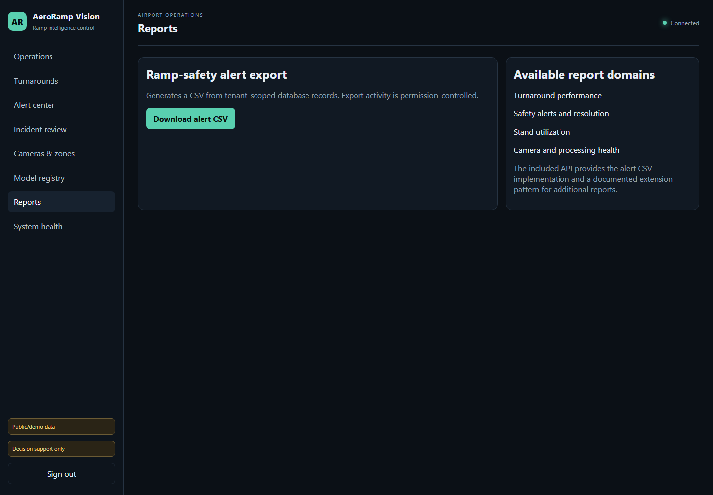

# AeroRamp Vision

[](https://github.com/HUSNAIN-MUNAWAR/aeroramp-vision/actions/workflows/ci.yml)
[](LICENSE)
[](pyproject.toml)
[](apps/api/aeroramp/main.py)
[](apps/web/package.json)
[](docker-compose.yml)
[](CONTRIBUTING.md)

Airport turnaround and ramp-safety intelligence platform that turns video into tracked objects, reviewable safety alerts, protected evidence, turnaround milestones, and operational dashboards.

> Aviation disclaimer: AeroRamp Vision is an operational decision-support and analytics platform. It is not certified by ICAO, IATA, FAA, EASA, any CAA, airport, airline, or ground handler. Production deployment requires site-specific validation, camera calibration, cybersecurity review, privacy review, legal review, and approval from the relevant airport and aviation authorities.

## Why This Exists

Airport turnaround teams often need a shared view of stand activity, safety-rule candidates, evidence, and milestone timing without pretending that a generic computer-vision model is an aviation-certified safety system. AeroRamp Vision provides a credible open-source reference architecture for that workflow: honest detector boundaries, auditable review states, tenant-aware APIs, and a runnable local demo.

## Features

- MP4/MOV/AVI decoding through OpenCV/FFmpeg-compatible codecs
- CPU motion detector for generic moving-object analysis
- Deterministic `synthetic_color` detector for the generated demo fixture
- Optional Ultralytics YOLO adapter for generic classes such as person, car, bus, truck, and aircraft
- Class-aware centroid tracking with short-occlusion tolerance
- Polygon entry, dwell, wrong-way, speed, stationary-equipment, pushback obstruction, and candidate near-miss rules
- Alert debounce/cooldown, deduplication, protected snapshots, evidence clips, reviewer decisions, incidents, and audit history
- Turnaround milestones, readiness decision support, and manual correction while preserving original predictions
- Multi-tenant SQLAlchemy data model with tenant-isolation tests
- PBKDF2-SHA256 password hashing, JWT auth, RBAC, trusted hosts, CORS allowlists, security headers, request IDs, and rate limiting
- Next.js operations console for dashboards, alerts, incidents, cameras/zones, model registry, reports, and system health
- Background worker, local MJPEG simulator, SQLite edge queue, authenticated edge synchronization, SDK examples, Alembic migrations, CI, and Docker Compose

## Architecture



Dense per-frame observations are stored as compressed `observations.json.gz` files. The relational database stores track summaries, alerts, milestones, evidence metadata, incidents, model records, edge sync batches, and audit logs.

## Screenshots

These screenshots were captured from the local Next.js application running against the FastAPI API after processing the DVIDS public-domain demo clip with the CPU `motion` detector. The records are public/demo data and do not represent a customer deployment.

| Operations overview | Alert center | Turnaround detail |
|---|---|---|
|  |  |  |

| Cameras and zones | Model registry | System health |
|---|---|---|
|  |  |  |



## Technology Stack

- Backend: Python 3.12, FastAPI, SQLAlchemy, Alembic, Pydantic, OpenCV, Shapely
- Frontend: Next.js 16, React 19, TypeScript
- Data: PostgreSQL for Docker/production-style runs, SQLite for local development and tests
- Infrastructure: Docker Compose, Redis service placeholder for future event-bus work, GitHub Actions CI
- Tooling: Ruff, mypy, pytest, npm type checking, Next.js production build

## Quick Start

```bash
py -3.12 -m pip install -e ".[dev]"
copy .env.example .env
py -3.12 -m alembic upgrade head
py -3.12 scripts/seed.py --reset
py -3.12 scripts/download_public_dataset.py
py -3.12 scripts/generate_synthetic_video.py
py -3.12 -m uvicorn aeroramp.main:app --app-dir apps/api --reload
```

In another terminal:

```bash
cd apps/web
npm ci
npm run dev
```

Open `http://localhost:3000` and sign in with the seeded development account:

```text
admin@aeroramp.local
AeroRamp-Dev-2026!
```

These credentials are sample-only and must be changed before any shared deployment.

## Local Development

The default `.env.example` uses SQLite so a contributor can run the API without Docker:

```env
AERORAMP_DATABASE_URL=sqlite:///./aeroramp.db
AERORAMP_CORS_ORIGINS=http://localhost:3000
AERORAMP_UPLOAD_DIR=storage/uploads
AERORAMP_EVIDENCE_DIR=storage/evidence
AERORAMP_OBSERVATION_DIR=storage/observations
NEXT_PUBLIC_API_URL=http://localhost:8000
```

Backend commands:

```bash
py -3.12 -m pip install -e ".[dev]"
py -3.12 -m alembic upgrade head
py -3.12 scripts/seed.py --reset
py -3.12 scripts/download_public_dataset.py
py -3.12 scripts/generate_synthetic_video.py
py -3.12 -m uvicorn aeroramp.main:app --app-dir apps/api --reload
```

Frontend commands:

```bash
cd apps/web
npm ci
npm run lint
npm run typecheck
npm run build
npm run dev
```

Docker Compose:

```bash
copy .env.example .env
docker compose config
docker compose build
docker compose up -d
```

Compose starts PostgreSQL, Redis, API, worker, web, and simulator services. The API is available at `http://localhost:8000`, the web console at `http://localhost:3000`, API docs at `http://localhost:8000/api/v1/docs`, and the MJPEG simulator at `http://localhost:8090/stream.mjpg`.

## Demo Workflow

1. Seed demo tenants, users, cameras, zones, rules, models, and one active turnaround.
2. Prepare `sample-data/dvids-age-public.mp4` from the official DVIDS public video stream.
3. Upload the MP4 through the API or SDK using the `motion` detector.
4. Run the processing job.
5. Review tracks, safety-alert candidates, evidence, incidents, milestones, and reports in the web console.

SDK example:

```python
from aeroramp_sdk import AeroRampClient

client = AeroRampClient("http://localhost:8000")
client.login("admin@aeroramp.local", "AeroRamp-Dev-2026!")
camera = client._get("/api/v1/cameras")[0]
turnaround = client.list_turnarounds()[0]
job = client.upload_video(
    camera_id=camera["id"],
    turnaround_id=turnaround["id"],
    path="sample-data/dvids-age-public.mp4",
    detector_backend="motion",
)
print(client.start_processing(job["id"]))
```

The deterministic synthetic fixture remains available for tests and repeatable rule-engine development:

```bash
py -3.12 scripts/generate_synthetic_video.py
```

## Public Dataset Demo

AeroRamp Vision includes a reproducible public-video demo derived from DVIDS video `838428`, `Aerospace Ground Equipment ensures aircraft are ready for flight`, published by DVIDS / U.S. Air Force and credited on DVIDS to Senior Airman Daira Jackson / 386th Air Expeditionary Wing.

- Source: https://www.dvidshub.net/video/838428/aerospace-ground-equipment-ensures-aircraft-ready-flight
- Public-use terms: https://www.dvidshub.net/about/copyright
- Attribution and non-endorsement notice: [data/NOTICE.md](data/NOTICE.md)
- Dataset documentation: [docs/DATASET.md](docs/DATASET.md)
- Committed sample: `sample-data/dvids-age-public.mp4`
- Manifest: `sample-data/dvids-age-public.json`

The preparation script streams the official DVIDS 768x432 HLS rendition, selects a 36 second window starting at 8 seconds, resamples it to 12 fps, resizes it to 640x360, and writes a SHA-256 manifest. The committed demo clip is about 3.5 MB; larger raw media belongs under Git-ignored `data/public/` or `data/raw/`.

```bash
py -3.12 scripts/download_public_dataset.py --force
```

On the 2026-07-19 local verification run, the app processed 432 source frames as 216 sampled inference frames with the `motion` backend. It persisted 152 generic `moving_object` tracks, 135 human-review safety candidates, one protected evidence snapshot and clip fetched through the authenticated evidence API, and a CSV alert report with 135 data rows. No training, labeling, accuracy evaluation, real-time claim, or airport certification was performed.

The demo uses public video, seeded local accounts, generic motion detection, and public/demo labels in the UI. It does not contain real customer data, private airport footage, credentials, passenger records, or production deployment evidence.

## API Examples

```bash
curl http://localhost:8000/health/ready
curl http://localhost:8000/api/v1/docs
```

Authenticated API calls require a bearer token from `POST /api/v1/auth/login`. See [docs/api-examples.md](docs/api-examples.md) for more request examples.

## CLI And Scripts

```bash
py -3.12 scripts/seed.py --reset
py -3.12 scripts/download_public_dataset.py --output sample-data/dvids-age-public.mp4
py -3.12 scripts/generate_synthetic_video.py --output sample-data/synthetic-ramp.mp4
py -3.12 scripts/evaluate_events.py --help
py -3.12 scripts/benchmark.py sample-data/dvids-age-public.mp4 --detector motion
py -3.12 scripts/retention_cleanup.py --help
```

Training/export helpers for optional custom detectors live in `scripts/train_yolo.py`, `scripts/export_yolo.py`, and `scripts/register_model.py`. They are not required for the default demo.

## Verification

```bash
py -3.12 -m ruff check .
py -3.12 -m mypy apps/api/aeroramp packages/sdk/python/aeroramp_sdk scripts
py -3.12 -m pytest
py -3.12 -m alembic upgrade head
py -3.12 -m alembic check
npm --prefix apps/web run lint
npm --prefix apps/web run typecheck
npm --prefix apps/web run build
npm --prefix apps/web audit --audit-level=high
docker compose config
```

The test suite includes an end-to-end API workflow that logs in, uploads a generated MP4, runs the real pipeline, verifies track/alert/milestone persistence, fetches protected evidence, records review decisions, creates an incident, and checks tenant isolation.

## Project Structure

```text
apps/api             FastAPI, SQLAlchemy, vision pipeline, API services
apps/web             Next.js operations console
apps/worker          database-backed processing worker
apps/inference       local MJPEG stream simulator
apps/edge_agent      SQLite offline queue and sync client
packages/sdk/python  lightweight Python API SDK
alembic              database migrations
configs              example custom-model dataset config
docs                 architecture, security, deployment, screenshots
sample-data          generated and sample demo media
scripts              seed, benchmark, evaluation, training/export helpers
storage              local upload/evidence/observation roots
tests                unit, vision, integration, and workflow tests
```

## Security Notes

- Do not use the seeded credentials in shared deployments.
- Do not commit `.env`, real RTSP URLs, credentials, passenger imagery, airport private data, or model checkpoints with unclear provenance.
- Pickle-based model formats are treated as unsafe unless sandboxed and explicitly reviewed.
- Evidence access is protected by authenticated API routes; production deployments should use object storage with signed URLs and retention policies.
- See [SECURITY.md](SECURITY.md) and [docs/security-model.md](docs/security-model.md).

## Limitations

- The default motion detector emits only `moving_object` and does not classify airport equipment.
- The DVIDS public demo is one short public B-roll clip and is not a validation benchmark.
- The synthetic color detector is only for the generated demo fixture.
- The centroid tracker is not a re-identification tracker such as BoT-SORT or DeepSORT.
- Metric speed rules require calibration; uncalibrated motion remains image-space only.
- No airport-specific model, production validation dataset, operational benchmark, or certification claim is included.
- The local simulator is MJPEG, not a full RTSP server.
- S3-compatible storage is documented as a production extension; the executable default uses local shared storage.

## Roadmap

- Browser-based homography solving and calibration quality checks
- First-class object-storage backend with signed evidence URLs
- Optional task queue/event bus integration for larger deployments
- Site-specific model validation reports and dataset versioning
- RTSP orchestration guidance for multi-camera deployments
- Contributor-friendly SDK packaging and typed API client generation

## Contributing

Contributions are welcome when they preserve the aviation-safety disclaimers, avoid unvalidated accuracy claims, and include focused tests. Start with [CONTRIBUTING.md](CONTRIBUTING.md), open a focused issue, and keep detector/rule behavior explicit and reviewable.

## License

MIT License. See [LICENSE](LICENSE).

## Attribution

AeroRamp Vision builds on open-source libraries including FastAPI, SQLAlchemy, Alembic, Pydantic, OpenCV, Shapely, PyJWT, Uvicorn, Prometheus Client, Next.js, React, and TypeScript. Optional YOLO workflows use Ultralytics when installed by the user. The synthetic fixture video is generated locally by `scripts/generate_synthetic_video.py`. The public demo clip is derived from DVIDS video `838428`; see [data/NOTICE.md](data/NOTICE.md) and [docs/DATASET.md](docs/DATASET.md).
