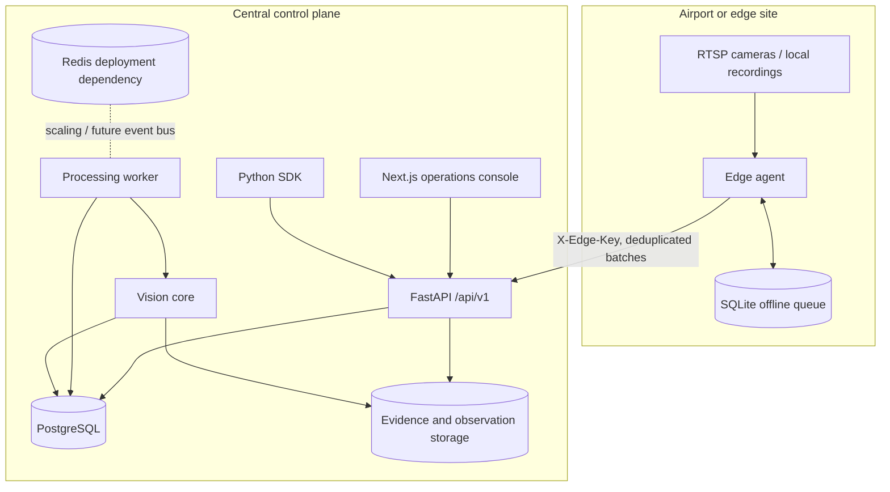

# Architecture

AeroRamp Vision is a modular monorepo. The executable reference deployment can run on one CPU machine, while the boundaries allow video processing and edge inference to be separated from the central control plane.

## Components

| Component | Responsibility |
|---|---|
| FastAPI API | Authentication, tenant authorization, airport configuration, uploads, jobs, alerts, incidents, evidence, reports, edge sync, and audit access |
| Processing worker | Claims durable jobs and executes decoding, inference, tracking, event reasoning, evidence generation, and persistence |
| Vision core | Detector adapters, centroid tracking, geometry, rule evaluation, milestones, overlays, evidence clips, and benchmark metrics |
| Next.js console | Operations overview, camera zones, turnarounds, synchronized evidence review, incidents, model registry, reports, and health |
| PostgreSQL | Tenant-scoped configuration, tracks, alerts, milestones, incidents, reviews, notifications, model records, edge batches, and audits |
| File/object storage | Uploaded video, compressed observations, evidence snapshots, clips, and annotated output |
| Edge agent | SQLite-backed offline queue, node-key authentication, deterministic batch deduplication, and health synchronization |
| Stream simulator | Replays actual video frames as a clearly labeled local MJPEG development stream |
| Python SDK | Calls real authenticated API endpoints for cameras, uploads, processing, turnarounds, alerts, and evidence |

## Request and tenant boundary

The access token identifies a user, organization, and role. Every authenticated request revalidates the user and exact organization membership against the database. Operational queries always include `organization_id`; direct object reads pass through a tenant check before data is returned or changed. Edge synchronization does not trust browser JWTs: the node is loaded by ID and its separately stored PBKDF2 API-key hash is verified.

## Durable processing

A video upload and a processing job are committed before processing starts. A job transitions through `queued`, `preparing`, `running`, and a terminal state. Progress and measured processing metadata are stored on the job. The API supports controlled synchronous execution for tests; the worker provides independent polling execution for normal development deployment.

## Observation storage

Per-frame observations can become much larger than relational business records. The implementation writes a compressed `observations.json.gz` archive per job and records its SHA-256 hash in job metrics. PostgreSQL stores searchable track summaries, centroids, event records, alerts, milestones, and evidence metadata. A production deployment can replace the local storage contract with S3-compatible object storage without moving dense frame data into unpartitioned relational rows.

## Trust boundaries

- Camera credentials are encrypted and never returned by camera APIs.
- Model registration accepts safe deployment formats by default and records a checksum.
- Uploaded videos are extension checked, bounded by size, decoded before acceptance, and stored outside the frontend tree.
- Evidence is served only through an authenticated, tenant-checked endpoint whose path is constrained to the evidence root.
- No biometric identification or worker-performance scoring is implemented.
