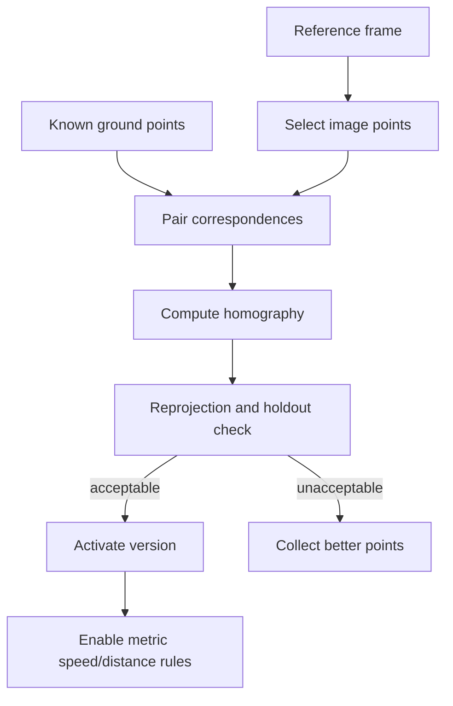

# Camera calibration

Calibration is versioned per camera. Each record stores reference points, optional homography matrix, image dimensions, ground-plane units, validation notes, error estimate, active state, and timestamps. Saving a new calibration deactivates the previous version while preserving it for audit and evidence interpretation.

## Image-space configuration

The web editor supports click-to-create polygons for aircraft envelopes, pushback paths, service zones, restricted areas, walkways, lanes, staging areas, ignore regions, and privacy masks. Polygon validity is checked before persistence.

## Metric calibration

A production metric workflow should collect at least four well-distributed image-to-ground correspondences, solve a homography, measure reprojection error, and validate scale with independent reference distances. The API model can store the matrix and error estimate. The executable reference uses `meters_per_pixel` reference metadata when present for speed rules.

If no valid metric calibration is active, the application labels coordinates and motion as image-space estimates and rejects creation of metric speed rules with `CAMERA_CALIBRATION_REQUIRED`.
