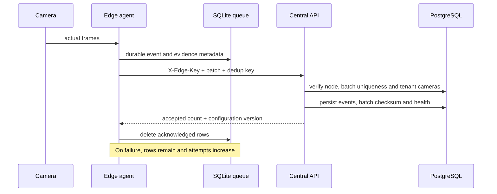

# Edge deployment and synchronization

The edge boundary is intended for low-latency inference, bandwidth control, and temporary offline operation. Central services remain responsible for tenant administration, review, reporting, long-term evidence, model governance, and audits.

## Implemented reference behavior

- SQLite durable queue with event IDs, payloads, creation time, and retry attempts
- deterministic SHA-256 batch deduplication key
- PBKDF2-hashed per-node API key, supplied as `X-Edge-Key`
- persisted central `edge_sync_batches` record and payload checksum
- validation that every uploaded camera belongs to the node organization
- node status, last sync time, health telemetry, and configuration version response
- successful acknowledgment only after central acceptance
- failed synchronization increments attempts and retains queued events



## Production hardening

Replace shared API keys with per-node certificates or hardware-backed identity where possible. Sign configuration bundles, pin model checksums, encrypt evidence chunks, enforce disk-watermark policies, monitor queue age, separate camera and management networks, restrict outbound destinations, and test safe rollback. Evidence upload should support resumable chunks and bandwidth budgets.

## Run the development agent

```bash
python apps/edge_agent/agent.py \
  --db edge-buffer.db \
  --api-url http://localhost:8000 \
  --node-id "$EDGE_NODE_ID" \
  --api-key edge-development-key
```

The seeded key is development-only and must not be used outside a local evaluation environment.
