# Custom model training

The main application does not require training. Airport-specific equipment classes require a licensed, representative, site-approved dataset and measured validation results.

## Dataset layout

Copy `configs/training/dataset.example.yaml` and change `path` to your dataset. Labels follow the Ultralytics detection format. Split by camera, date, stand, weather, and operational scenario to reduce leakage; do not put adjacent frames from the same clip across train and test sets.

## Install optional tooling

```bash
pip install -e '.[yolo]'
```

## Train

```bash
python scripts/train_yolo.py \
  --data configs/training/dataset.yaml \
  --model yolo11n.pt \
  --epochs 100 \
  --imgsz 960 \
  --batch 8 \
  --seed 2026 \
  --device 0
```

The script invokes the real Ultralytics training API with deterministic mode and records the dataset, base model, image size, seed, device, and output directory. The repository contains no fabricated result files.

## Evaluate

```bash
python scripts/evaluate_yolo.py \
  --checkpoint runs/aeroramp/detector/weights/best.pt \
  --data configs/training/dataset.yaml \
  --split test \
  --output runs/aeroramp/evaluation/metrics.json
```

Review per-class failures, camera slices, night/rain slices, occlusion, small objects, and confusion between visually similar service vehicles. A single aggregate mAP is not sufficient for a safety-related review workflow.

## Export and register

```bash
python scripts/export_yolo.py \
  --checkpoint runs/aeroramp/detector/weights/best.pt \
  --format onnx \
  --imgsz 960 \
  --opset 17

python scripts/register_model.py \
  --email admin@aeroramp.local \
  --password 'AeroRamp-Dev-2026!' \
  --name 'Airport equipment detector' \
  --version 1.0.0 \
  --classes 'aircraft,person,pushback_tug,baggage_cart,belt_loader' \
  --checkpoint runs/aeroramp/detector/weights/best.onnx \
  --validation-metrics '{"dataset":"site-test-v1"}'
```

The export command calculates SHA-256. Registration accepts ONNX or safetensors by default and stores class list, framework, resolution, checksum, validation metadata, and deployment status.

```mermaid
flowchart LR
  Data[Licensed site data] --> Train[Reproducible training]
  Train --> Validate[Held-out evaluation and slices]
  Validate --> Export[ONNX / safetensors export]
  Export --> Hash[Checksum and metadata]
  Hash --> Register[Model registry]
  Register --> Assign[Camera / edge deployment]
  Assign --> Observe[Latency, errors and drift]
  Observe --> Rollback[Rollback when acceptance gates fail]
```


