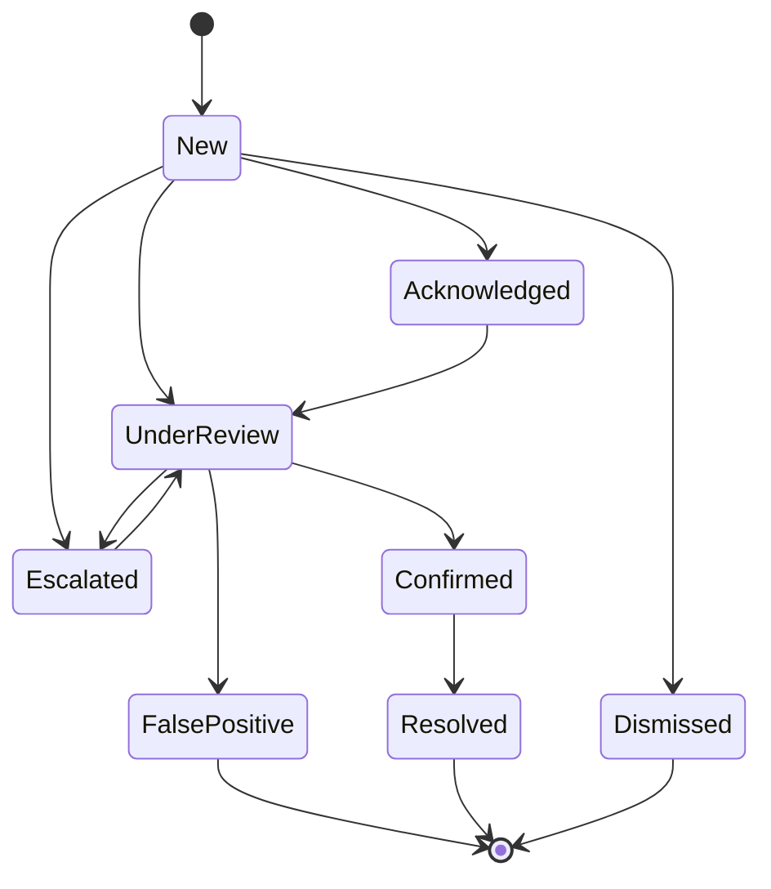
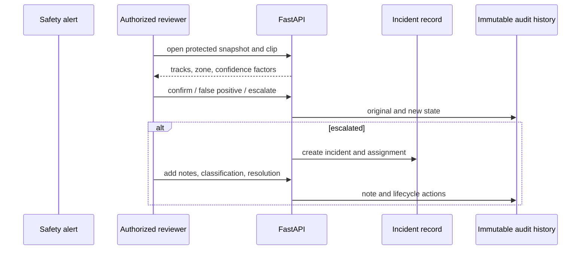

# Safety rule engine

Safety output is a configurable review candidate, not a guaranteed determination. Rules are database records carrying camera, optional zone, type, severity, classes, parameters, debounce, cooldown, active state, and version.

## Implemented rule families

| Rule | Inputs | Important limitation |
|---|---|---|
| Person/configured class in restricted zone | Track centroid, polygon, dwell | Class and authorization cannot be inferred from appearance |
| Pushback-path obstruction | Track, pushback polygon, dwell | Operational phase should be integrated for real deployment |
| Excess speed | Ground-plane movement, threshold, persistence | Rejected without metric calibration |
| Wrong-way movement | Travel vector, expected direction, minimum movement | Camera perspective and lane configuration require validation |
| Equipment left behind | Stationary displacement, zone dwell, class | Fixture class is generic service vehicle unless custom model exists |
| Candidate near-miss | Relative motion and closest point of approach | Monocular estimate requiring human review |

## Debounce, cooldown, and deduplication

A condition must remain true for its configured debounce duration before an alert can be emitted. Cooldown suppresses repeated alerts for the same rule/track after emission. Persistence adds a deterministic key derived from processing job, rule, track, and event time so retries do not create one alert per frame.

## Alert confidence

The transparent confidence calculation combines detection confidence, track persistence, zone/dwell support, and rule certainty. Metric-dependent rules reduce or reject confidence when calibration is unavailable. Confidence is not a probability of guilt, authorization, or accident.

## Lifecycle

## Incident review flow

Original inference is preserved in alerts, events, and review decisions. Human corrections do not erase the model output.
