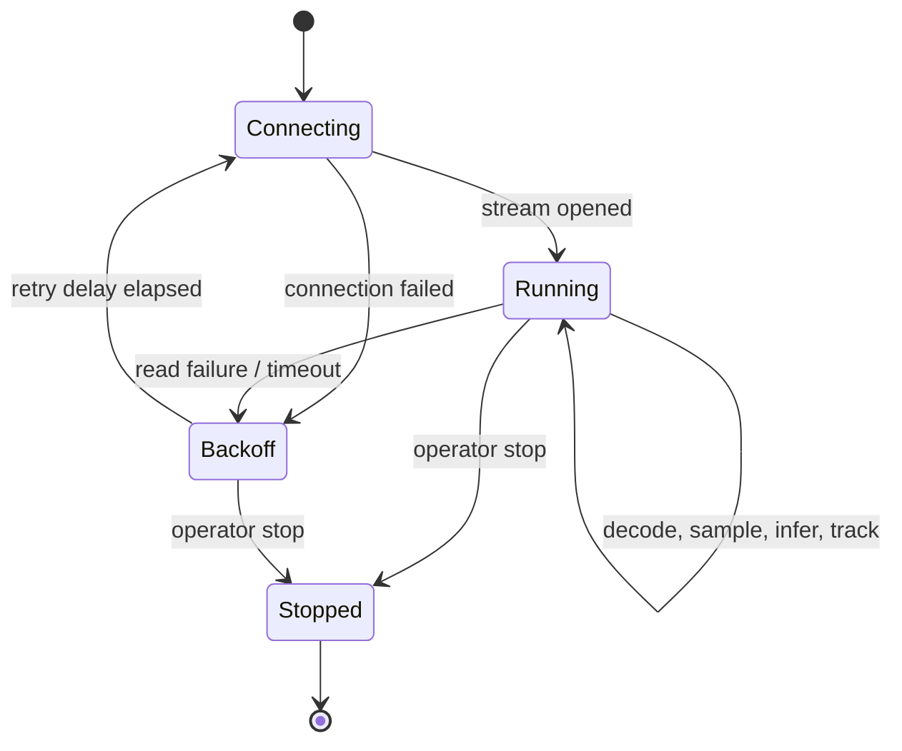

# Tracking and live streams

## Bundled tracker

The reference tracker performs class-aware nearest-centroid association. A detection can continue only a track with the same class and within the configured distance gate. It supports track creation, continuation, missed-frame tolerance, short occlusion recovery, termination, confidence aggregation, bounding-box history, centroid history, and velocity summaries.

This tracker is deliberately deterministic and CPU friendly. It does not claim cross-camera identity or strong appearance re-identification. Severe occlusion, dense apron traffic, long disappearances, and visually similar equipment should be evaluated with ByteTrack, BoT-SORT, or DeepSORT before deployment.

## Track persistence

PostgreSQL stores one summary row per track, including source camera, job, optional turnaround association, class, first/last timestamp, mean confidence, compressed-observation path, centroid history, image-space velocity summary, zone history, and terminal status. Anonymous track IDs are scoped to a processing session and are not biometric identities.

## Live stream flow

The `LiveStreamProcessor` reads actual frames from a URL or local stream, samples according to the configured inference rate, updates the tracker and rule engine, and exposes processed-frame, dropped-frame, reconnect, latency, and health values. The local simulator loops the included MP4 as MJPEG and is visibly labeled as simulated live mode.

## Coordinate interpretation

Centroids are image-space pixels unless a valid camera calibration is active. Image-space speed is never presented as km/h. Metric scale is used only when the calibration declares meter units and provides usable reference scale data.
