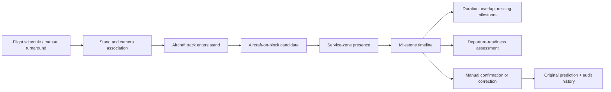

# Turnaround engine

A turnaround associates a stand, flight identity, aircraft information when known, planned times, actual times, state, confidence, and review status. The reference event engine derives only milestones that its detector and configured zones can support honestly.

## Implemented milestone logic

- `aircraft_on_block`: the aircraft-class track enters the configured aircraft envelope and persists for the minimum dwell.
- `unclassified_service_vehicle_present`: a generic service-vehicle track remains in a configured service or staging zone.

The engine intentionally does not call a generic truck a fuel, catering, lavatory, or baggage vehicle. Those milestones require a class-specific model, external operational data, or manual input.

## Observation kinds

- `observed`: direct system input or unambiguous visual event.
- `rule_inference` / `inferred`: temporal or spatial reasoning over tracks.
- `manual_correction`: authorized reviewer correction with original value retained.
- `unavailable`: expected milestone not observable from the configured camera or data sources.

## Turnaround flow

## Readiness assessment

The readiness engine returns one of `not_ready`, `at_risk`, `nearly_ready`, `ready_for_review`, or `confirmed_ready`. It lists supporting conditions, missing conditions, active high-severity alerts, confidence, last update, and manual-confirmation requirement. It never authorizes aircraft movement or departure.

## KPI behavior

The API calculates counts, confirmed-alert count, manual-correction count, and turnaround duration when actual on/off-block timestamps exist. Additional service durations and critical-path variance become available only when corresponding milestone data is present; missing data is not silently replaced by synthetic values.
