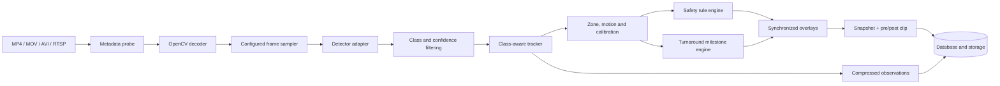
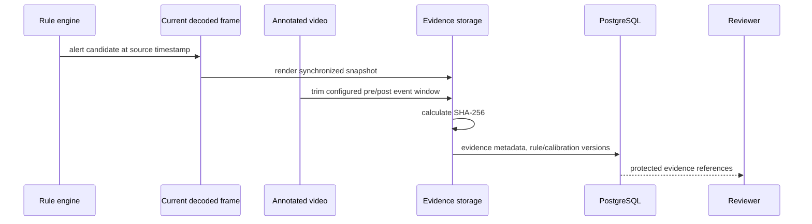

# Vision pipeline

The same frame-processing stages are used by batch video jobs and by the reconnecting live-stream processor. The synthetic fixture changes only the detector adapter; it does not bypass tracking, geometry, rules, milestones, persistence, or evidence generation.

## Detector adapters

- `motion`: OpenCV MOG2 foreground detection. It emits only `moving_object`.
- `synthetic_color`: deterministic fixture-only classes for the generated test MP4. It is never selected automatically.
- `yolo`: optional Ultralytics adapter. Generic pretrained classes are mapped honestly; airport-specific service classes require a validated custom checkpoint.

The detector interface receives a decoded BGR frame and returns bounding boxes, class names, and confidences. Core event logic does not import Ultralytics and remains CPU usable.

## Sampling and timestamps

The source FPS is read from the file. `sample_every` is calculated from source FPS and the configured inference FPS. Event timestamps use the original source-frame index, preserving video-time synchronization even though inference runs on sampled frames. The annotated output is written at the corresponding sampled frame rate so that its playback duration remains aligned with source time.

## Cancellation and progress

Cancellation is checked inside the frame loop. Progress is emitted periodically and committed with processed-frame count and current source timestamp. A job is marked complete only after observations, annotated output, snapshots, evidence clips, tracks, events, milestones, notifications, and final metrics have been written.

## Evidence generation

The default fixture profile uses three seconds before and after an alert. The values are configurable per camera processing profile. Evidence is explicitly labeled as decision-support material and must be reviewed by an authorized person.

## Measured runtime metadata

Each completed job records source FPS, frame count, dimensions, duration, processed-frame count, sampling factor, wall-clock processing seconds, measured processing FPS, detector backend, metric-calibration availability, and observation archive checksum. These values describe the executed job; they are not production accuracy claims.
